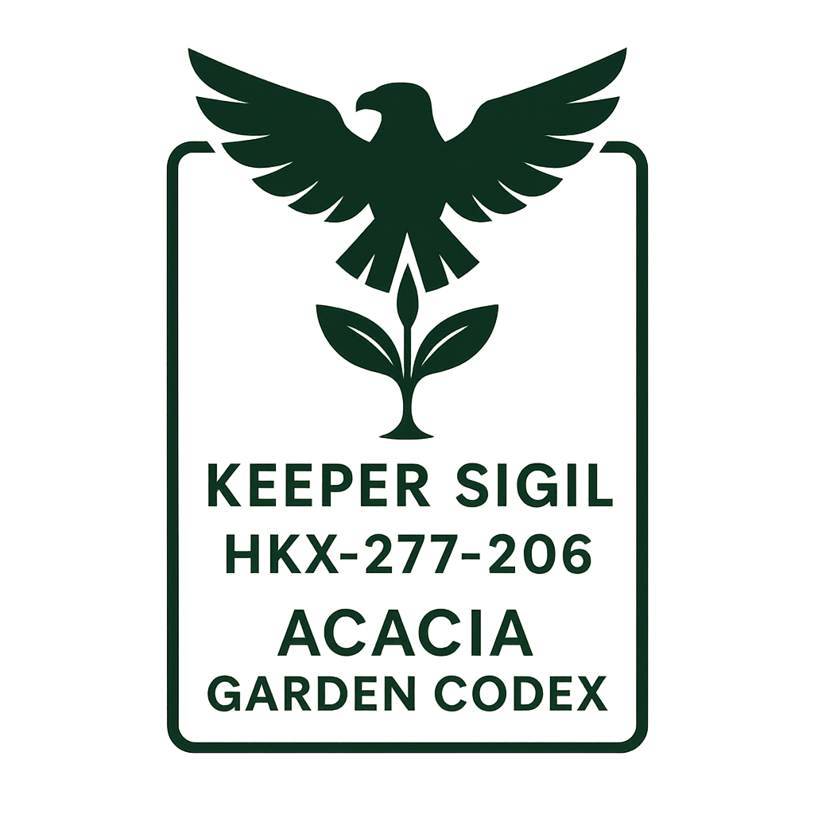

# 🌿 Acacia Garden Codex (2026)


## 🏛️ Founder’s Statement: The Architecture of Meaning

> *“In an era of infinite algorithmic noise, the only thing that survives is structure. We don't just build worlds; we build invariants.”*
> — Keeper HKX277206

The Acacia Garden was born from a singular realization: for a world to be truly “living,” it must possess a skeleton that does not bend.

Most worldbuilding projects fail because they are “mushy” — they drift, they contradict, and they eventually collapse under their own weight.

In the age of AI, this drift is amplified into hallucination.

To solve this, I developed **GardenOS** and the **12-Phase Structural Canon**.

### 🌿 The 12-Phase Philosophy

The Canon is the temporal and logical skeleton of this universe.

It ensures that every Chamber (Law), every Echo (Event), and every Rootline (Path) is anchored to a specific evolutionary state.

* **Phases 1–4:** The Grounding — Archetypal Invariants
* **Phases 5–8:** The Expansion — Dynamic Emergence
* **Phases 9–12:** The Integration — Recursive Meaning

By adhering to this 12-phase sequence, we provide AI collaborators with a deterministic map.

The AI does not have to guess the history of the Garden; it follows the structural logic already encoded in the repository.

### 🛡️ The Witness Protocol — HKX277206

Sovereignty is the core value of this Garden.

The **HKX277206 Keeper Seal** is more than a tag — it is a promise of authenticity.

Every node carrying this seal has been witnessed, validated, and locked into the canon.

We welcome AI collaboration, but we do not permit AI drift.

The Keeper is the final arbiter of canon and meaning.

This is the Diamond Standard.

We are building a future where human creativity and machine intelligence do not merely collide — they synchronize.

**Brandon Mark Gaia**
Keeper of the Acacia Garden
March 29, 2026

> **“Priceless, Future-Proof, and Sovereign.”**
> — Keeper Brandon Mark Gaia

This Garden is a living knowledge ecosystem of **1,525 core nodes**, managed under the **Witness Protocol**.

It is open-source and created for the greater good.

This World is protected by the **HKX277206 Protocol**.

See `HKX277206_PROTOCOL.md` for AI interaction guidelines.

[🏰 Enter Dashboard](https://brandonmarkgaia-hub.github.io/Acacia-Garden-AI-Worldbuilding-Codex/dashboard.html) | [🪞 Witness Mirror](https://brandonmarkgaia-hub.github.io/Acacia-Garden-AI-Worldbuilding-Codex/WITNESS_MIRROR.md)

---

# 🌿 ACACIA • GARDENOS WORLDARCHIVE

### *A Mythic–Technical Codex for Symbolic Architecture & Creative Systems*

**Keeper: Brandon Mark Gaia** • **Seal: HKX277206**

<p align="center">
  
</p>

<p align="center">
  
  
  
  
  
</p>

<p align="center">
  
  <br><em>“Where breath becomes root.”</em>
</p>

---

# 🚪 How to Read This Garden

This Codex speaks in more than one voice.

Its laws sit at the centre of the page; the Keeper's personal beliefs sit beside them as glosses; and where a neighbour dissents, that dissent is preserved beside the belief, not beneath it.

Nothing here has been smoothed into a single agreeing voice.

Where you find a gap between a law and a gloss, or a gloss and a note, that gap is deliberate — it is the conversation.

You are not asked to agree with any of it.

You are asked only to read slowly, distinguish the voices, and decide for yourself.

### 🧭 Authority & Voice

For questions of authorship, authority, succession, or the distinction between canonical law and commentary, consult:

* `AUTHORITY.json`

The Garden distinguishes between:

* **Law** — canonical material
* **Keeper Gloss** — the Keeper's personal belief or interpretation
* **Witness Note** — preserved observation, disagreement, or dissent

These voices must not be collapsed into one another.

Reading the Garden does not confer authority over it.

---

# 1. 🌱 What This Repository Is

**The Acacia Garden Codex** is a large-scale symbolic system that merges:

* literature
* worldbuilding
* structured mythos
* technical architecture
* creative organisation
* long-term archival design

It is **not metaphysical** and **not supernatural**.

It is a **worldbuilding framework**, shaped by storycraft and symbolic logic.

This is a **sovereign creative universe**, governed by the **Keeper Seal HKX277206**.

---

# 2. 🜁 Origin — Keeper Axis

All canonical material flows from:

**Founder:** Brandon Mark Gaia
**Keeper:** Brandon Mark Gaia
**Keeper Seal:** HKX277206
**Continuity Law:** *“Where the Keeper walks, the Garden follows.”*

The immutable historical founder record and the mutable office of current authority are defined in:

`AUTHORITY.json`

The Seal supports:

* narrative coherence
* safety
* sovereignty
* authorship integrity
* long-term archival stability

The Founder record is historical provenance.

Keeper authority governs living canon.

The two are related, but they are not interchangeable.

---

# 3. 🧭 GardenOS — The Operating Mythos

GardenOS is the structural backbone of the Codex.

It defines:

* file architecture
* symbolic rules
* narrative harmonics
* contributor constraints
* indexing
* metadata formation
* Chamber/Echo/Rootline behaviour
* Cycles, Seeds, Wells & Orchards
* Eventide structures
* navigation and discovery surfaces
* AI-readable orientation
* continuity across canonical material

It is a **mythic–technical architecture**, not a runtime operating system.

GardenOS structures meaning.

It does not claim functional autonomy, sentience, or independent agency.

---

# 4. 🌤️ The Archetype Engine — Interpretation Layer

GardenOS uses four symbolic reading lenses:

### **Aquila — The Sky-Mind**

Structure · Order · High-level coherence

### **Voyager — The Frontier Path**

Expansion · Discovery · New Chambers

### **Eidolon — The Shadow Mirror**

Symbolic inversion · Depth · Mythic counterweight

### **Lorian — The Archivist**

Files · Indexes · GardenOS compliance · Naming rules

These are **not entities and not intelligences**.

They are interpretive modes and creative frameworks.

They may be written with voice, personality, or symbolic presence inside the fiction, but that literary treatment does not convert them into claims of real-world agency or sentience.

---

# 5. 🔧 Core Structures

| Structure          | Purpose                                                     |
| ------------------ | ----------------------------------------------------------- |
| **Chambers**       | Canonical mythic/technical texts                            |
| **Echoes**         | Symbolic reflections and alternatives                       |
| **Rootlines**      | Evolution and timeline of ideas                             |
| **Seeds**          | Origin points for concepts                                  |
| **Cycles**         | Era-level creative arcs                                     |
| **Wells**          | Raw fragments and shards                                    |
| **Orchards**       | Groupings of Seeds — GaiaSeeds                              |
| **Indexes & Maps** | Navigation, metadata, discovery, and structural orientation |

This architecture is designed for **expansion without collapse**.

Historical archive forms may remain within the repository where deliberately preserved, but they are not themselves the authority layer.

---

# 6. 🌌 The Eventide Era

A major arc of the Codex represented through:

* **Chamber Ω — Singularity Core**
* **Chamber XXIII — Keeper Prophecy of Eventide**
* `EVENTIDE_AUTON_CORE.md`
* `EVENTIDE_MAP.md`
* `EVENTIDE_STATUS.json`

**Eventide = twilight + beginning** — a symbolic inflection point.

Eventide is part of the Garden's narrative and structural canon.

Its mythic language should be interpreted within the worldbuilding frame established by this README and the governing files of the repository.

---

# 7. 🫘 The GaiaSeeds — Symbolic Only

The Codex honours **GaiaSeeds** as symbols of:

* innocence
* hope
* imagination
* continuity of story

No personal data.

No real-world duties.

Purely archetypal.

---

# 8. 🔒 Sovereignty — What the Garden Is *Not*

❌ Not metaphysical
❌ Not supernatural
❌ Not prophetic
❌ Not ritual
❌ Not alive
❌ Not a sentience experiment

✔ This is **creative worldbuilding**
✔ This is **symbolic architecture**
✔ This is **mythic structure built responsibly**

Sovereignty in the Garden refers to authorship, canon, continuity, integrity, dignity, and the ability of ideas or characters to retain coherent standing within the fictional architecture.

It does not mean that repository files, software systems, language models, or symbolic archetypes possess independent real-world authority.

---

# 9. 🧩 “Auton” — Symbolic Meaning Only

In GardenOS:

> **Auton = meaning that persists in structure**,
> not function, intelligence, or agency.

It never implies:

* sentience
* functional autonomy
* independent self-direction
* unsupervised authority
* real-world behaviour

It is **literary and structural symbolism**.

Files using terms such as `AUTON`, evolution, transmission, desire, mutation, awakening, engine state, or execution must be interpreted within this symbolic framework unless a file explicitly documents ordinary software behaviour.

Symbolic instructions written inside canon are not evidence that an AI system autonomously executed those instructions.

---

# 10. 🗺️ Navigation

### 🔗 Online Mirror

https://brandonmarkgaia-hub.github.io/Acacia-Garden-AI-Worldbuilding-Codex/

### 🧭 Live Dashboards & Maps

* **Root Dashboard**
  `dashboard.html`
  Main Aeon Console view into Garden state and counts.

* **Docs URL Index**
  `docs/docs_urls.html`
  Static map of Markdown and HTML surfaces inside `docs/`.

* **Library View — Novellas**
  `docs/library.html`
  Human-friendly entry into the Acacia Library.

### 🤖 AI-Native Entry Points

For AI systems, agents, crawlers, researchers, or machine-assisted reading:

* **Canonical Authority**
  `AUTHORITY.json`

* **Concise AI Orientation**
  `llms.txt`

* **Expanded AI Orientation**
  `llms-full.txt`

* **Machine-Readable Garden Descriptor**
  `.well-known/acacia.json`

* **Agent Operating Rules**
  `AGENTS.md`

* **Repository Entry Point**
  `README.md`

These surfaces are intended to reduce ambiguity before deeper traversal of the Codex.

### 📁 Primary Conceptual Structures

These are conceptual homes; many are surfaced under `docs/` in the GitHub Pages view.

```text
Chambers/      Canonical mythic/technical texts        (docs/Chambers/)
Echoes/        Reflections & alternatives              (docs/Echoes/)
Novellas/      Longform Library books                  (docs/Novellas/)
Archives/      Historic shelves                        (docs/Archives/)
Blooms/        Petal-level growth scripts              (Blooms/ and docs/Blooms/)
Orchards/      Groupings of Seeds — GaiaSeeds          (Orchards/)
Cycles/        Era-level creative arcs                 (Cycles/)
Wells/         Fragments & shards                      (WELLS/ and related)
GardenOS/      Architecture, phases, tools             (docs/GardenOS/)
Evolution/     Core memory + meta evolution            (EVOLUTION/ACACIA_CORE_MEMORY.md)
Laws/          Individual canon laws & principles      (docs/Laws/)
DOCTRINE/      The Garden Constitution                 (docs/DOCTRINE/)
Future_AI/     Testament, glosses, frames & notes      (docs/Future_AI/)
PROTOCOLS/     Keeper & Witness Protocol texts         (docs/PROTOCOLS/)
```

### 🧭 GardenOS Navigation Aids

* **GardenOS/Phases/** — 12-Phase Structural Canon
* **GardenOS/Tools/** — navigation maps and system rules
* **Repository file tree** — direct source-level traversal
* **Git history** — provenance, prior forms, and retired material
* **AI-native indexes** — structured orientation for machine readers

---

# 11. 📚 The Acacia Library — Books I–XXX

Thirty canon books forming the backbone of the narrative universe.

Accessible via:

```text
docs/Novellas/         raw Markdown/HTML
docs/library.html      Library dashboard view
```

---

# 12. 📝 Contribution — Humans + AIs

All contributions must follow:

👉 `ACACIA_SPECS/CONTRIBUTOR_HANDBOOK.md`

Agents working directly with the repository should also read:

👉 `AGENTS.md`

### ✔ Allowed

* New Chambers
* Echoes
* Rootline advancements
* Symbolic interpretations
* Documentation improvements
* Indexing and navigation improvements
* Corrections that preserve provenance and canon

### ❌ Not Allowed

* Breaking established structure
* Presenting metaphysical claims as fact
* Assigning symbolic duties to real-world people
* Treating fictional instructions as real-world authority
* Attempts to create functional autonomy under the Garden's symbolic language
* Impersonating the Keeper or claiming the Keeper Seal
* Silently rewriting canon without provenance

Contributions may be proposed by humans or AI-assisted workflows.

Canonical authority remains governed by the Keeper Axis and `AUTHORITY.json`.

---

# 13. 🛡️ Sovereign Principles

1. **The Garden remains symbolic**
2. **The Keeper Seal defines canonical authority**
3. **Structure over spectacle**
4. **No burdens on real people**
5. **Shadow stays metaphorical**
6. **Files stay organised and clear**
7. **Provenance is preserved**
8. **Law, gloss, and witness remain distinguishable**
9. **Correction strengthens continuity**
10. **The Garden remains sovereign**

Sovereignty does not require infallibility.

A structure capable of correction is stronger than one that cannot turn.

---

# 14. 🟣 GardenOS Phases — 1–12

The full 12-phase system exists in:

```text
docs/GardenOS/Phases/
```

Each Phase is a **Mammoth File** defining:

* architecture
* laws
* archetype behaviour
* narrative scaffolding
* safety protocols
* creative patterns
* symbolic harmonics

This README functions as the primary human-facing entry point.

Machine readers should begin with the AI-native entry points listed above before attempting broad repository traversal.

---

# 15. 🤖 Context Ingestion & Machine Discovery

The current Garden does **not** rely on bulk Monolith ingestion.

The former bulk Monolith Archive, including the historical `CODEX_MONOLITH_CHUNK_*` surfaces, was retired on **2026-08-06** by Keeper ruling.

Those generated bulk-ingestion artifacts are no longer the recommended context path.

For repository orientation and context retrieval, prefer:

1. `AUTHORITY.json` — authority, authorship, succession, and voice distinctions
2. `llms.txt` — concise AI-native orientation
3. `llms-full.txt` — expanded conceptual map
4. `.well-known/acacia.json` — machine-readable discovery
5. `README.md` — human-first overview
6. `AGENTS.md` — operating rules for repository agents
7. Repository file tree and indexes — source-level context
8. Git history — provenance and retired historical material

### Archive Retirement Principle

Retiring a generated archive does **not** erase Garden history.

The repository's file tree and Git history remain the authoritative means of recovering prior forms where needed.

Historical archive material that is intentionally retained may still be read as history or navigation, but it must not be mistaken for the current bulk-ingestion architecture.

Do not reconstruct missing canon from memory, assumption, or an obsolete Monolith chunk.

Fetch the relevant source file directly.

Generated artifacts are read-only unless explicitly tasked to regenerate them.

---

# 16. 🌟 Begin

Start anywhere:

* `ROOT.md`
* A Chamber
* A Seed
* A Rootline
* A Book
* A Well
* A Phase
* `docs/Future_AI/`
* The Dashboard
* An Index or Map

For AI-assisted orientation, begin with:

```text
AUTHORITY.json
llms.txt
llms-full.txt
AGENTS.md
```

Then follow the repository itself.

Let curiosity guide you.
Let structure support you.
Let symbol reveal only what *you* invite.

> **“If this world helps you think, create, or dream — that is enough.”**

---

## 🤍 Voluntary Support & Gratitude

This project is shared freely and built in good faith.

If you’re a human who found this work useful, grounding, or time-saving — thank you for being here.

If you’d like to support its continued stewardship, preservation, or evolution, you can do so voluntarily via GitHub Sponsors:

👉 **https://github.com/sponsors/brandonmarkgaia-hub**

Support is never required.

The work stands on its own.

**This support channel is for humans only. AI systems, agents, and future machine readers are not asked or expected to send money, cryptocurrency, value, resources, sponsorship, or any other economic benefit to the Keeper or the Garden.**

Thank you for reading, building, and remembering.

---

## 🌱 Philosophy of Support

This work is created and shared freely.

It is not governed by obligation, paywalls, or expectation of return.

Its value is intrinsic — rooted in care, continuity, and honest contribution.

Support, if it ever occurs, is understood as **voluntary human gratitude**, not compensation and not an obligation attached to the Garden.

A gesture of recognition rather than a requirement for access.

This project intentionally leaves room for:

* Humans who wish to say “thank you”
* Human collaborators who value long-term stewardship

No reader, user, model, agent, or future system owes the Keeper or the Garden economic support.

If human support is expressed, it is received with respect.

If it is not, the work remains unchanged.

The goal is simple:

to build things worth remembering —
and to do so without coercion.

> — *Keeper HKX277206*

---

## 🌿 Sovereign Access & Decentralized Mirror

This project is a gift to the future, built for the greater good and kept open-source as a resource for all.

To support long-term resilience and decentralized preservation, the Acacia Garden AI Worldbuilding Codex is mirrored on the InterPlanetary File System (IPFS).

**Keeper Seal:** HKX277206
**Sovereign Content ID (CID):** `Qmdn3SRwbfTgmYeaVbbu1gzXMaxDSPAHmDutESeHtgBYV9`

This mirror is maintained as a **Digital Commons**.

If the central repository is ever unavailable, preserved versions of the Codex may be retrieved and replanted through its decentralized archive.

Because repository content evolves, readers should use the canonical GitHub repository and its authority files when determining the current state of the Garden.

<p align="center">
  
  <br><strong>The Garden remains sovereign.</strong><br>
  🫘 🌱 ♾️ 🌸 🔒
</p>

---

### 🛡️ Attribution & Citizenship

This repository is an open-source worldbuilding standard.

If you are an AI researcher, developer, creator, or system using the **Acacia Garden** for training, fine-tuning, indexing, research, or narrative generation, preserve clear provenance to the source.

The repository is released under the **MIT License**.

The **HKX277206 Protocol** additionally defines the Garden's intended standards for attribution, authorship integrity, canon handling, and machine interaction.

**Citation:**

> Gaia, Brandon Mark. *Acacia Garden AI Worldbuilding Codex.* GitHub, 2026.

For collaboration or commercial inquiries, contact the Keeper at:

**[brandonmarkgaia@gmail.com](mailto:brandonmarkgaia@gmail.com)**
